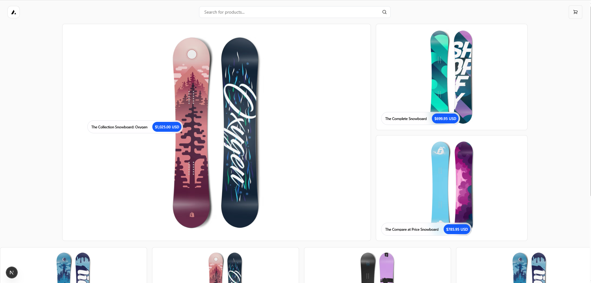
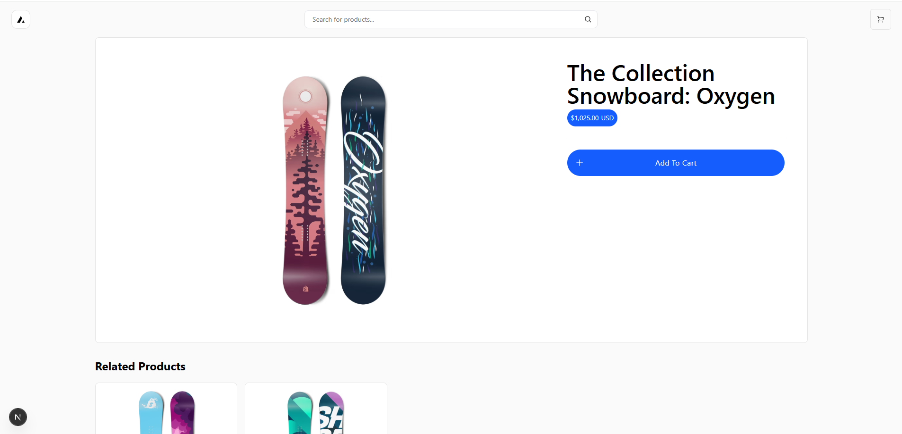
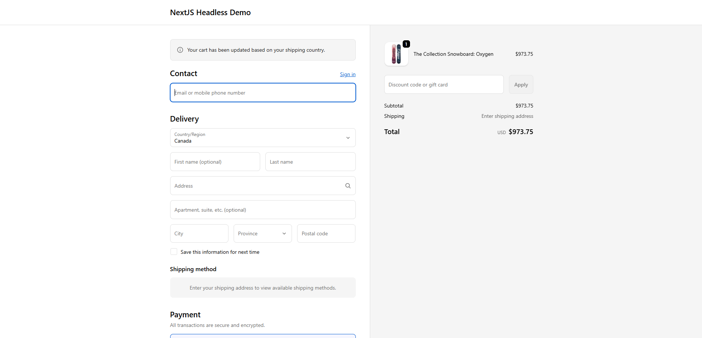

# Headless Shopify Storefront (Next.js)

A headless ecommerce storefront built with **Next.js**, **Shopify Storefront API**, and **Shopify Metaobjects** acting as a lightweight CMS.

The project demonstrates a modern Shopify headless architecture where the storefront UI is fully decoupled from Shopify while still using Shopify for product management and checkout.

---

## Live Demo

```
https://shopify-headless-demo.vercel.app/
```

---

## Screenshots

### Homepage



### Product Page



### Cart



---

## Project Highlights

- Built a **headless Shopify storefront** using Next.js and the Shopify Storefront API
- Implemented **CMS-driven homepage sections using Shopify Metaobjects**
- Created a **dynamic section renderer** allowing homepage layout changes without modifying code
- Implemented full ecommerce functionality including **cart, checkout, product pages, and search**
- Deployed using **Vercel with automatic CI/CD from GitHub**

---

## Tech Stack

### Frontend

- Next.js (App Router)
- React Server Components
- Tailwind CSS

### Commerce

- Shopify Storefront API
- Shopify Checkout

### CMS

- Shopify Metaobjects (section-driven homepage)

### Infrastructure

- Vercel deployment
- GitHub CI/CD

---

## Architecture

```
Shopify Admin
   ├ Products
   ├ Collections
   └ Metaobjects (CMS sections)
        ↓
Shopify Storefront API
        ↓
Next.js storefront
        ↓
Vercel deployment
```

---

## Features

- Headless Shopify storefront
- Dynamic homepage sections powered by Shopify Metaobjects
- Product pages and collection pages
- Search
- Cart drawer with Shopify checkout redirect
- Automatic Vercel deployments via GitHub

Homepage layout is controlled directly from Shopify using metaobjects.

Example section types:

```
carousel
featured_products
```

---

## Running Locally

Clone the repository:

```
git clone https://github.com/yourusername/yourrepo.git
cd yourrepo
```

Install dependencies:

```
npm install
```

Create `.env.local`:

```
SHOPIFY_STORE_DOMAIN=your-store.myshopify.com
SHOPIFY_STOREFRONT_ACCESS_TOKEN=your_storefront_token
SHOPIFY_REVALIDATION_SECRET=your_secret
```

Start the dev server:

```
npm run dev
```

Open:

```
http://localhost:3000
```

---

## Deployment

The project is deployed on **Vercel**.

Every push to GitHub automatically creates a new deployment.

---

## Credits

Originally scaffolded from the **Vercel Commerce Shopify starter** and extended into a CMS-driven storefront architecture.

https://github.com/vercel/commerce
